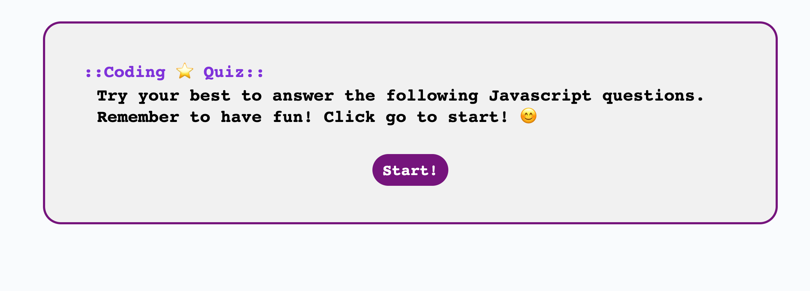
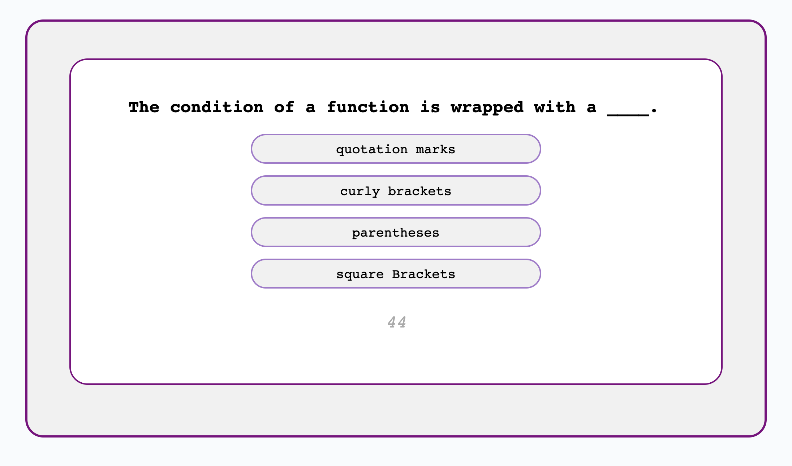

# Coding Quiz

Created a quiz app designed to assess students' JavaScript knowledge. The app features a timer that sets a 60-second limit for answering six questions. Incorrect answers deduct time from the countdown. After each quiz session, participants can input their initials to record their scores, which are subsequently displayed on a leaderboard.

## Getting Started

Not Available

### Prerequisites

Not Available

### Installing

Not Available

### Code Snippet

Not Available

## Built With

* [HTML](https://developer.mozilla.org/en-US/docs/Web/HTML)
* [CSS](https://developer.mozilla.org/en-US/docs/Web/CSS)
* [JavaScript](https://www.javascript.com/)

## Deployed Link

* [See Live Site](https://eviehoang.github.io/coding-quiz/)

## Authors

* **NHI HOANG** 

- [Link to Portfolio Site](https://eviehoang.github.io/evie-portfolio/)
- [Link to Github](https://github.com/eviehoang)
- [Link to LinkedIn](https://www.linkedin.com/in/ynhihoang/)

See also the list of [contributors](https://github.com/your/project/contributors) who participated in this project.

## License

Not available at this time. 

## Acknowledgments

* Thanks to fellow classmates for motivation, tips and tricks, and patience.
* [W3School](w3schools.com/) for example codes to reference.
* Thanks to Robert Parson for assitance with functions during tutoring session.
